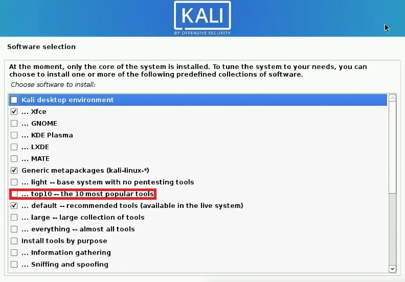

## Installation kali linux

- [Installation kali linux](#installation-kali-linux)
    - [Ressources allocated to kali linux](#ressources-allocated-to-kali-linux)
    - [Log in credentials for user](#log-in-credentials-for-user)
    - [Log in credentials for root](#log-in-credentials-for-root)
    - [Network Configs](#network-configs)
    - [Important steps in the Configuration](#important-steps-in-the-configuration)
    - [Installation](#installation)
    - [sources](#sources)
    - [navigation](#navigation)

#### Ressources allocated to kali linux

Here I will list all of the ressources:

| Component     | Description                                       |
|---------------|---------------------------------------------------|
| Memory        | 4GB                                               |
| Processors    | 16 total cores 4 Logical cores, 4 Processor Cores |
| Harddisk      | 60GB                                              |
| Networkcard 1 | NAT                                               |
| Networkcard 2 | Custom Network                                    |

#### Log in credentials for user

Username: kali
Password: kali

#### Log in credentials for root

username: root
password: root

#### Network Configs

|                | network-id    | subnetmask    | fixed-ip-address |
|----------------|---------------|---------------|------------------|
| custom network | 100.100.100.0 | 255.255.255.0 | ———————          |
| Kali VM        | 100.100.100.0 | 255.255.255.0 | ———————          |
| Metasploit VM  | 100.100.100.0 | 255.255.255.0 | 100.100.100.20   |
| Windows 10 VM  | 100.100.100.0 | 255.255.255.0 | 100.100.100.30   |

#### Important steps in the Configuration

Upon installation process be sure to tick the box that says download top 10 popular tools.
See image below.

#### Installation

I downloaded the imagefile from the [official kali linux](https://www.kali.org/get-kali/#kali-installer-images).

I then made a new Virtual Machine in VMware Workstation PRO 16 and made the usuals steps to install a new virtual machine.

In the installer menu I set my preferred option, such as keyboard layout, language and region/timezone.

Then I made the account, set the password after that I was prompted with the choice if I wanted to install the GRUB boot loader to the master boot record, to that I said yes. After that I selected the disk for the GRUB installation. And so my Installation of Kali linux was successful.

#### sources

I used the guide on how to install Kali linux as a reference so that I could write this documentation and also use the screenshots from the guide.

[Guide on how to install Kali Linux](https://computingforgeeks.com/install-kali-linux-step-by-step-with-screenshots/)

#### navigation

* [Back to README](../README.md)
* [Forward to Metasploit installation](MetasploitableInstallation.md)

---

&copy; Rayan Lee Bopp